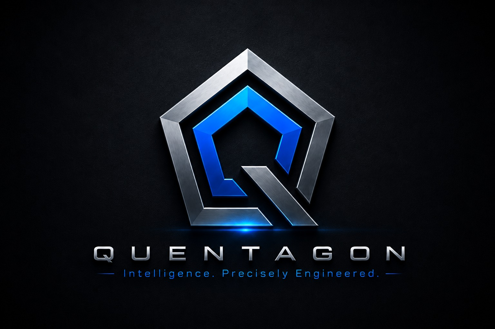
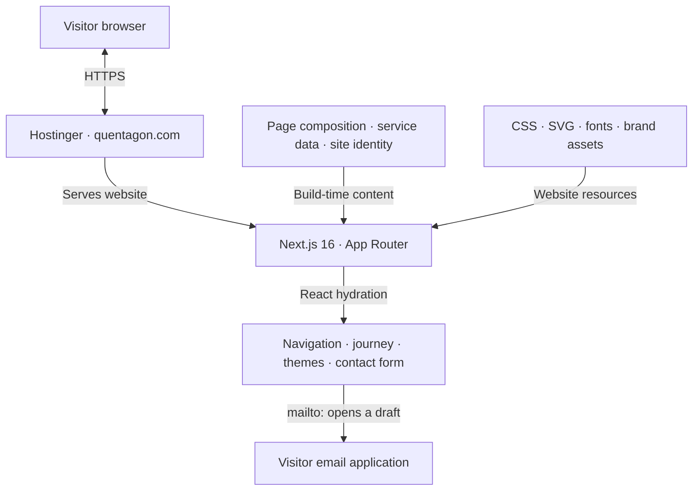

<h1 align="center">Quentagon</h1>

<p align="center"><strong>Technology Studio &amp; Digital Solutions Website</strong></p>

<p align="center">
  
</p>

<p align="center">
  <strong>Engineering intelligence for progress.</strong><br />
  Software, websites and intelligent workflows that make your business work better.
</p>

<p align="center">
  
</p>

<p align="center">
  
  
  
</p>

<p align="center">
  <a href="https://quentagon.com/">Live Website</a> ·
  <a href="CONTRIBUTING.md">Contributing</a> ·
  <a href="SECURITY.md">Security</a> ·
  <a href="https://github.com/rizad-mohamed/Quentagon/actions/workflows/ci.yml">CI Results</a>
</p>

Co-founded by **[Rizad Mohamed](https://github.com/rizad-mohamed)** and **[Hirusha Nilupul](https://github.com/M-K-Hirusha)**.

Website developed by **Rizad Mohamed**; Hirusha contributes as a collaborator in this repository.

---

## Project Status

| Item                  | Current state                                                                 |
| --------------------- | ----------------------------------------------------------------------------- |
| Public website        | [quentagon.com](https://quentagon.com/)                                       |
| Source repository     | [rizad-mohamed/Quentagon](https://github.com/rizad-mohamed/Quentagon), `main` |
| Deployment source     | This repository: `rizad-mohamed/Quentagon`, `main`                            |
| Hosting               | Hostinger Next.js deployment                                                  |
| Application           | Public business website with browser interactions                             |
| Contact               | Email draft opened in the visitor's email application                         |
| Client portal and bot | Coming soon                                                                   |

Rizad's GitHub repository is connected directly to Hostinger. Both co-founders collaborate in this repository through branches and pull requests; reviewed changes merged into `main` are the source for website deployment.

---

## Contents

- [Project Overview](#project-overview)
- [Problem Statement](#problem-statement)
- [Proposed Solution](#proposed-solution)
- [Core Features](#core-features)
- [Website Workflow](#website-workflow)
- [Architecture](#architecture)
- [Technology Stack](#technology-stack)
- [Prerequisites](#prerequisites)
- [Repository Structure](#repository-structure)
- [Quick Installation](#quick-installation)
- [Environment Configuration](#environment-configuration)
- [Common Commands](#common-commands)
- [Testing and Release Verification](#testing-and-release-verification)
- [CI and Deployment](#ci-and-deployment)
- [Troubleshooting](#troubleshooting)
- [Development Workflow](#development-workflow)
- [Security Rules](#security-rules)
- [Project Documentation](#project-documentation)
- [Limitations](#limitations)
- [Future Direction](#future-direction)
- [Project Background](#project-background)
- [Repository](#repository)
- [License and Use](#license-and-use)

---

## Project Overview

Quentagon currently serves as the company's official landing page, introducing its services, work, delivery process, founders and vision. The responsive website gives prospective clients a clear route from exploring the studio's capabilities to preparing a project enquiry.

This is the shared source and deployment repository: **[rizad-mohamed/Quentagon](https://github.com/rizad-mohamed/Quentagon)**.

The public website is available at **[quentagon.com](https://quentagon.com/)**. Hostinger deploys directly from **[rizad-mohamed/Quentagon](https://github.com/rizad-mohamed/Quentagon)** on `main`. Hirusha works as a collaborator in this repository; an additional repository is not part of the deployment workflow.

---

## Problem Statement

A technology studio needs to explain its services, show relevant work and make its delivery process understandable to prospective clients. A fragmented presentation can make it difficult for visitors to identify the right service or know how to begin a project.

Quentagon brings those parts together in one accessible website with consistent navigation, responsive layouts and a clear enquiry path.

---

## Proposed Solution

The website combines service presentations, an eight-stage project journey, project references and product previews. Visitors can explore the studio's capabilities, learn how a project progresses and prepare an email enquiry.

The implementation combines Next.js-rendered content with React client components for interactive behavior. It is a frontend website: the current code does not include an application backend, database or authentication system.

---

## Core Features

### Services and Capabilities

Seven service presentations cover:

- Custom software development.
- Web and e-commerce solutions.
- Mobile application development.
- AI and automation.
- Cybersecurity.
- Cloud, DevOps and integrations.
- Technology consulting and support.

### Project Journey and Showcase

- Eight-stage delivery journey with keyboard-accessible tabs and stage controls.
- Project references and visual showcase previews.
- Product previews and coming-soon integration messaging.
- Illustrative service dashboards and workflow animations.

### Contact Enquiries

- Name, email, service and project-detail fields.
- Browser form validation and input-length limits.
- An encoded `mailto:` link that opens a draft in the visitor's email application.
- A direct email link and a copy-email control.

**Submitting the form does not send an email or store a submission.** The visitor must review and send the draft in their email application.

### Responsive Interface and Accessibility

- Mobile, tablet and desktop layouts.
- Light-first design with persistent explicit light/dark selection.
- Keyboard navigation, focus handling and a skip-to-content link.
- Reduced-motion support and a decorative-motion control.
- SVG artwork, scroll interactions and self-hosted fonts.

### Metadata and Discoverability

- Page title, description, canonical and social metadata.
- Sitemap and robots routes.
- Brand favicon and social artwork.
- Custom missing-page response.

Illustrations and demonstration data do not establish that the displayed customer systems or integrations are deployed. Automated accessibility checks supplement manual review.

---

## Website Workflow

### Delivery Journey

The live page presents eight stages: **Discover → Define → Architect → Design → Build → Validate → Deploy → Support**. These are an illustrative engagement process; scope, milestones and support are agreed for each project.

1. Explore the services and capabilities.
2. Review the delivery process and project references.
3. Select a service and describe a project in the contact form.
4. Open the prepared email draft.
5. Review and send the enquiry using an email application.

The client portal and Quentagon Bot integrations are marked as coming soon. They do not provide an authenticated portal or a live AI service in the current implementation.

---

## Architecture

The diagram describes the implemented website and its current Hostinger delivery path. The dashboards, API gateway and AI workflows shown in service illustrations are examples of offered capabilities, rather than services running behind this website.



Content comes from `app/`, `data/` and `lib/`; React client components provide browser interactions. The visitor sends an enquiry from their email application. There is no business API, database, account system or server-side enquiry delivery in this repository.

| Part          | Responsibility                                                                                                  |
| ------------- | --------------------------------------------------------------------------------------------------------------- |
| `app/`        | Page composition, layout, styles, metadata, sitemap, robots and missing-page handling                           |
| `components/` | Navigation, service presentations, journey controls, showcase previews, themes, motion and contact interactions |
| `data/`       | Structured service and capability content                                                                       |
| `lib/`        | Shared site identity and navigation                                                                             |
| `public/`     | Brand assets and static-host header configuration                                                               |
| `scripts/`    | Local static preview and Lighthouse audit                                                                       |
| `tests/`      | Browser interaction and accessibility coverage                                                                  |

Local and CI builds use `output: "export"` in `next.config.ts` and generate the static site in `out/`. Images are configured as unoptimized for static hosting.

Hostinger's Next.js preset overrides the output setting with standalone server mode and uses `.next/` instead. That hosted server mode does not add a business backend, database or authentication features to this application.

---

## Technology Stack

| Area                   | Technologies                                         |
| ---------------------- | ---------------------------------------------------- |
| Framework              | Next.js 16, App Router                               |
| Interface              | React 19, TypeScript                                 |
| Styling                | CSS, SVG artwork                                     |
| Motion                 | Motion                                               |
| Icons                  | Phosphor Icons                                       |
| Fonts                  | Self-hosted Manrope and IBM Plex Mono                |
| Local tooling          | Node.js 24, npm, Git                                 |
| Code quality           | ESLint, Prettier, TypeScript checking                |
| Browser testing        | Playwright, Chromium, axe-core                       |
| Performance audit      | Lighthouse                                           |
| CI                     | GitHub Actions in this repository                    |
| Current public hosting | Hostinger, deploying this repository's `main` branch |

Dependencies are pinned in `package.json`, and `package-lock.json` supports reproducible installation with `npm ci`.

---

## Prerequisites

Install Git, Node.js 24 and the npm version supplied with Node.js. `.nvmrc` selects Node.js 24 for local development and CI.

```sh
git --version
node --version
npm --version
```

Use PowerShell on Windows or a POSIX shell on macOS/Linux. A database or backend service is not required.

---

## Repository Structure

| Path                               | Contents                                              |
| ---------------------------------- | ----------------------------------------------------- |
| `app/page.tsx`                     | Main website page                                     |
| `app/layout.tsx`                   | Root layout, fonts, theme initialization and metadata |
| `app/robots.ts`, `app/sitemap.ts`  | Discoverability routes                                |
| `app/not-found.tsx`                | Missing-page UI                                       |
| `components/`                      | Interactive and presentation components               |
| `data/capabilities.ts`             | Service descriptions and capability data              |
| `lib/site.ts`                      | Site identity, email, fallback origin and navigation  |
| `public/brand/`                    | Optimized logo, favicon and social artwork            |
| `assets/brand-originals/`          | Original supplied brand images                        |
| `scripts/serve.mjs`                | Local static-preview server                           |
| `scripts/audit.mjs`                | Lighthouse audit script                               |
| `tests/`                           | Playwright test files                                 |
| `.github/workflows/ci.yml`         | Repository validation workflow                        |
| `.github/PULL_REQUEST_TEMPLATE.md` | Pull request template                                 |
| `.openai/hosting.json`             | Earlier ChatGPT Sites project configuration           |
| `.env.example`                     | Safe environment-variable placeholder                 |
| `.nvmrc`                           | Node.js version selection                             |
| `CONTRIBUTING.md`, `SECURITY.md`   | Contribution and security guidance                    |

---

## Quick Installation

### 1. Clone and Install

```sh
git clone https://github.com/rizad-mohamed/Quentagon.git
cd Quentagon
npm ci
```

### 2. Configure the Public Origin

Copy `.env.example` to `.env.local`.

POSIX shell:

```sh
cp .env.example .env.local
```

PowerShell:

```powershell
Copy-Item .env.example .env.local
```

For a build intended for the live domain, set:

```env
NEXT_PUBLIC_SITE_URL=https://quentagon.com
```

### 3. Start Development

```sh
npm run dev
```

Open [http://127.0.0.1:3000](http://127.0.0.1:3000).

### 4. Preview a Production Export

```sh
npm run build
npm start -- --port 3003
```

Open [http://127.0.0.1:3003](http://127.0.0.1:3003). The preview server binds to localhost and is for verification; it is not the production hosting service.

---

## Environment Configuration

| Variable               | Purpose                                                                                                                                                                                                                          |
| ---------------------- | -------------------------------------------------------------------------------------------------------------------------------------------------------------------------------------------------------------------------------- |
| `NEXT_PUBLIC_SITE_URL` | Public absolute origin used at build time for canonical, social, sitemap and organization URLs. Set to `https://quentagon.com` for production. Without an override, the code uses the earlier preview origin from `lib/site.ts`. |
| `PLAYWRIGHT_BASE_URL`  | Optional browser-test and audit URL; defaults to `http://127.0.0.1:3003`. Playwright starts the local preview only when this override is absent.                                                                                 |
| `PORT`                 | Local static-preview port; defaults to `3003`. The `--port` command argument takes precedence.                                                                                                                                   |

No credentials are required to run the frontend. `NEXT_PUBLIC_` variables are public and must never contain secrets. Real environment files are ignored; `.env.example` contains safe placeholders.

---

## Common Commands

| Command                     | Purpose                                                     |
| --------------------------- | ----------------------------------------------------------- |
| `npm ci`                    | Install the locked dependencies                             |
| `npm run dev`               | Start the development server                                |
| `npm run build`             | Generate the local production static export in `out/`       |
| `npm start`                 | Serve the local export on port 3003                         |
| `npm run lint`              | Run ESLint                                                  |
| `npm run typecheck`         | Check TypeScript without emitting files                     |
| `npm run test:e2e`          | Run Chromium interaction and accessibility tests            |
| `npm run format`            | Format application files, scripts, configuration and README |
| `npm run format:check`      | Check formatting                                            |
| `npm run audit:performance` | Audit a running preview with Lighthouse                     |

---

## Testing and Release Verification

The repository includes browser tests in `tests/site.spec.ts` and `tests/theme-motion.spec.ts`, using Playwright and axe-core. There is no separate unit-test suite.

Coverage includes responsive overflow, themes, keyboard navigation, motion preferences, resource loading, runtime errors and accessibility.

Run the validation sequence:

```sh
npx playwright install chromium
npm run format:check
npm run lint
npm run typecheck
npm run build
npm run test:e2e
```

Playwright starts the production static preview automatically when `PLAYWRIGHT_BASE_URL` is not set. Build the export before running the tests.

For a performance audit, keep `npm start` running in one terminal and run `npm run audit:performance` in another. The report is written to `artifacts/lighthouse-mobile.json`.

This section describes the available checks, not a fixed pass count or a claim that the latest commit passed. Check the relevant GitHub Actions run for current results. Lighthouse reports lab measurements rather than field-performance guarantees.

---

## CI and Deployment

### Repository CI

`.github/workflows/ci.yml` runs on pushes to `main`, pull requests and manual dispatch. It uses Node.js 24 and runs dependency installation, formatting, lint, types, production build and Chromium browser checks.

Successful runs upload the `quentagon-static-site` artifact containing `out/`. Failed runs upload available browser diagnostics. Set the repository Actions variable `NEXT_PUBLIC_SITE_URL` to `https://quentagon.com` for production-origin artifacts.

GitHub Actions validates and packages the static export. Hostinger builds and deploys the connected `main` branch separately; its deployment is managed through the Hostinger GitHub connection.

### Current Hostinger Deployment

| Setting              | Value                                        |
| -------------------- | -------------------------------------------- |
| Live domain          | `https://quentagon.com/`                     |
| Connected repository | `rizad-mohamed/Quentagon`                    |
| Connected branch     | `main`                                       |
| Framework            | Next.js                                      |
| Node.js              | 24.x                                         |
| Root directory       | `./`                                         |
| Build script         | `build` / `npm run build`                    |
| Output directory     | `.next` (Next.js default)                    |
| Public build origin  | `NEXT_PUBLIC_SITE_URL=https://quentagon.com` |

Keep Hostinger's default Next.js output directory as `.next`. Its preset applies `output: "standalone"` and overrides the repository's `output: "export"` setting. It starts the generated standalone server; the repository's `npm start` remains a local static-preview command.

**Do not select `out` as the output directory for Hostinger's Next.js preset.** That directory is produced by local and CI static exports, and selecting it for the hosted standalone build causes a missing-output-directory deployment failure.

See [Hostinger's Next.js documentation](https://docs.hostinger.com/node.js/overview-1/next) and [GitHub deployment documentation](https://docs.hostinger.com/node.js/github).

### Publishing Updates

1. Create a branch in `rizad-mohamed/Quentagon` and make the intended change.
2. Open a pull request, review the change and ensure CI passes.
3. Merge the approved pull request into `main`.
4. Hostinger deploys the connected `main` branch when automatic deployment is enabled. If needed, use **Redeploy → Save and redeploy** in Hostinger to deploy its latest code.
5. Confirm the deployment succeeds and check the affected pages on [quentagon.com](https://quentagon.com/).

Both Rizad and authorized collaborators follow this shared repository workflow. Website updates do not require copying commits into another GitHub repository. README-only changes update GitHub documentation; they do not change the visible website.

### Other Static Hosts and Earlier Configuration

For a compatible static host, set its public origin, run `npm run build` and publish the contents of `out/`. Preserve `/_next/` assets, configure `404.html` as the missing-page response, and apply `public/_headers` where supported or equivalent host settings.

The header file is not proof that Hostinger applies those headers to its Node.js deployment. `.openai/hosting.json` records the earlier ChatGPT Sites project and does not configure the current Hostinger deployment. GitHub Pages is not configured. Changing the public origin requires rebuilding.

---

## Troubleshooting

### Hostinger reports a missing output directory

Use `.next` with Hostinger's Next.js preset. That preset builds a standalone server, while the repository's local and CI configuration exports `out/`. Selecting `out` for the preset produces the wrong output-directory expectation.

### The live website does not reflect a merge

Confirm Hostinger is connected to `rizad-mohamed/Quentagon` on `main`, and check that the pull request was merged into that branch. Review the deployment status and build logs. If automatic deployment is disabled, redeploy the latest `main` commit manually. A README-only merge does not change website content.

### Contact does not send an email automatically

The form opens a `mailto:` draft. Configure an email application or use the displayed email address directly. The visitor must send the message; this repository has no submission API or delivery queue.

### Browser tests cannot open the local preview

Run `npm run build` first, then install Chromium with `npx playwright install chromium`. With no `PLAYWRIGHT_BASE_URL` override, Playwright starts the local static server on port 3003. If an override is set, the target server must already be running.

### Metadata still points to the earlier preview domain

Set `NEXT_PUBLIC_SITE_URL=https://quentagon.com` in the relevant build environment, then rebuild and redeploy. Changing a build-time variable does not rewrite an existing build.

---

## Development Workflow

Both co-founders work in **`rizad-mohamed/Quentagon`**. Rizad maintains the repository and hosting connection; Hirusha contributes as a repository collaborator.

1. Pull the latest `main` from this repository and create a focused topic branch.
2. Make the intended change and run the relevant validation checks.
3. Commit with a descriptive Conventional Commit message.
4. Open a pull request with the change, validation results and any remaining limitations.
5. Review the changes and ensure CI passes before merging.
6. Verify Hostinger's deployment of this repository's `main` branch and check the live website.

See [CONTRIBUTING.md](CONTRIBUTING.md) for the full contribution guidance. Preserve contributor attribution and genuine commit history.

---

## Security Rules

- Keep real environment values and hosting credentials out of Git.
- Public build variables must not contain secrets.
- The contact form opens a local email draft; it does not store enquiry data in a database.
- Review production hosting headers and settings separately from local static-preview behavior.
- Report suspected vulnerabilities privately using the contact in [SECURITY.md](SECURITY.md).

---

## Project Documentation

| File                                                 | Purpose                                                   |
| ---------------------------------------------------- | --------------------------------------------------------- |
| [CONTRIBUTING.md](CONTRIBUTING.md)                   | Branches, validation, pull requests and attribution       |
| [SECURITY.md](SECURITY.md)                           | Private vulnerability reporting and security expectations |
| [.env.example](.env.example)                         | Safe public-origin configuration example                  |
| [.github/workflows/ci.yml](.github/workflows/ci.yml) | CI validation and static artifact packaging               |
| [next.config.ts](next.config.ts)                     | Local and CI static-export configuration                  |
| [playwright.config.ts](playwright.config.ts)         | Browser-test target and local preview configuration       |

---

## Limitations

- Service dashboards, workflow animations and product previews are illustrative.
- Client portal and Quentagon Bot integrations are coming soon.
- Contact submissions require the visitor's email application and are not sent automatically.
- There is no application backend, database or user authentication.
- Automated accessibility checks do not replace manual accessibility review.
- Package version `1.0.0` does not establish a release tag or a production-readiness certification.

---

## Future Direction

Quentagon is planned to grow beyond its current landing page into a comprehensive business management platform. The intended direction includes:

- Company operations and internal business management.
- Client management and shared project visibility.
- Client onboarding.
- Workflow automation.
- A client portal and related integrations.

These are planned capabilities, not features implemented in the current website. Their requirements, implementation scope and release milestones will be agreed as development progresses.

Alongside that direction, ongoing website work can improve enquiry delivery, browser and accessibility coverage, production performance and search metadata.

---

## Project Background

Quentagon was co-founded by **Rizad Mohamed** and **Hirusha Nilupul**. Its current website introduces the company, services and vision, with a longer-term direction toward integrated business management.

Rizad developed the website and maintains the GitHub repository connected to Hostinger. Hirusha works in the same repository as a collaborator. Contributor attribution and genuine commit history should be preserved.

| Item                             | Details                                                                                    |
| -------------------------------- | ------------------------------------------------------------------------------------------ |
| Project name                     | Quentagon                                                                                  |
| Project type                     | Technology studio and business services website                                            |
| Tagline                          | Engineering intelligence for progress.                                                     |
| Website developer                | [Rizad Mohamed](https://github.com/rizad-mohamed)                                          |
| Source and deployment repository | [rizad-mohamed/Quentagon](https://github.com/rizad-mohamed/Quentagon)                      |
| Live website                     | [quentagon.com](https://quentagon.com/)                                                    |
| Co-founders                      | Rizad Mohamed and Hirusha Nilupul                                                          |
| Repository collaboration         | Hirusha contributes as a collaborator in Rizad\'s repository                               |
| Production hosting               | Hostinger, connected to this repository\'s `main` branch                                   |
| Primary visitors                 | Prospective clients exploring services, work and project enquiries                         |
| Main objective                   | Present the studio's capabilities, delivery process and work through an accessible website |

---

## Repository

[https://github.com/rizad-mohamed/Quentagon](https://github.com/rizad-mohamed/Quentagon)

```sh
git clone https://github.com/rizad-mohamed/Quentagon.git
```

---

## License and Use

No license has been selected in this repository. Contact the maintainer before assuming permission to redistribute the code or brand assets. Package metadata does not grant a license or imply a release.
